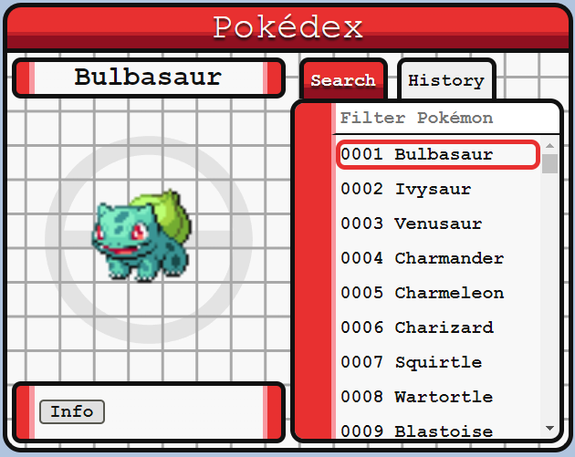
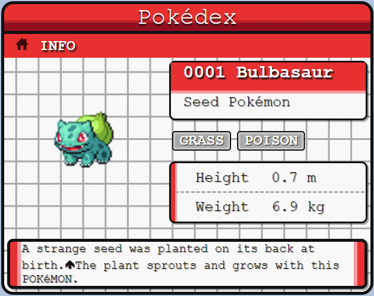

# Pokédex

As part of a technical assessment, I was given the challenge of using [PokeAPI](https://pokeapi.co) to create a React Pokédex application, using TypeScript and Redux.

I decided to use the Vite Redux template from the [Redux Toolkit documentation](https://redux-toolkit.js.org/introduction/getting-started).

## Goals

- ✅ Use the Pokemon API to make API requests for data.
- ✅ Able to search for any Pokemon.
- ✅ Able to see a history of what has been searched and revisit at anytime.

### Stretch Goals

- ✅ A sleek and intuitive layout that resembles a Pokedex.
- ✅ Automated tests that ensure the business logic.
- 🟨 Able to see details about abilities, moves, species, sprites and types upon searching.
- ❌ Able to see other evolutions of Pokemon and be able to navigate to specific Pokemon in the evolution chain.

## Takeaways

### Things I Learned

#### Redux, Redux Toolkit, and RTK Query

This was my first time using Redux and Redux Toolkit in a project. I haven't needed it in either professional or personal projects up until this point, but I am glad I had an excuse to use it!

Overall, I thought it was pretty easy to get started and I found it useful to use a centralized state store. It saved me from having to do too much prop drilling in the history and search components, I could just update the history state from Search and see that reflected in History! I also thought Immer is a cool package, and it made it easy to update objects in state, since I didn't have to think too much about mutating objects on accident. That being said, I also learned that it is a no-no to store non-serializable objects in a Redux store after trying to store my history object as a Set, and seeing weird behavior.

#### PokeAPI

Overall, a pretty cool project with a lot of lover out on the internet. I learned a lot more about Pokemon from poking around the API than I did playing the games, or collecting cards growing up.

There are some things I didn't love about the API, like not having the ability to search on a partial Pokemon name, and not being able to request multiple resources at once.

### Decisions I Made

#### Filtering instead of searching

For this application, I decided to fetch a list of all Pokemon species from PokeAPI and filtering on names locally, instead of searching the API for a given Pokemon. This was for a couple of reasons: PokeAPI does not provide an API for searching on partial name matches, and the list of Pokemon species was small enough that manipulating it locally is low cost and saves the need for, potentially, many network calls.

#### History duplicates

I didn't feel like duplicate history entries for the same Pokemon would be useful for a user, and decided to treat the history as a list of most recently viewed pokemon. This decision made the history implementation a little easier, since I did not have to think about the size of the history object. It can never be larger than then total number of Pokemon species.

#### List name hyphens

You may notice that some Pokemon's names are different in the list than in the details pane (e.g. Type: Null vs Type-Null, Iron Treads vs. Iron-Treads). That is because PokeAPI only provides a human readable string (with proper punctuation and spaces) for names returned as part of the Pokemon species details endpoint, and not in the list of all Pokemon species. To save unnecessary network calls (Up to 1025, one for each Pokemon species), I decided to used the Pokemon Species resource name returned in the list of all Pokemon species. I feel like this is an API limitation, although it is potentially solved in the beta GraphQL API which I decided not to use.

### How I Worked and Next Steps

I kept track of my progress in [todo.md](./todo.md). I decided to track them in a text document, because I thought it would be easier than creating a bunch of GitHub issues or using a Google Doc to track stories and features. I think using something a little more full featured, like a Trello board, would have been more helpful to collect my thoughts and organize features I wanted to work on.

Take a look at the todo document to see what I haven't gotten to yet!

### Things I Used

- https://cssgradient.io/ to help visualize some of the Pokedex backgrounds and borders.
- https://pokenode-ts.vercel.app/ for PokeAPI type interfaces.
- https://mswjs.io/ to mock API calls for testing.
- https://reactrouter.com/ for application routing.
- https://www.youtube.com/watch?v=9zySeP5vH9c to learn about modern Redux.
- https://essentialsdocs.fandom.com/wiki/Pok%C3%A9dex for Pokedex layout inspiration.
- https://redux-toolkit.js.org/
- https://redux-toolkit.js.org/rtk-query/overview

## Screenshots

### Overview Page

### Info Page

## Scripts

- `dev`/`start` - start dev server and open browser
- `build` - build for production
- `preview` - locally preview production build
- `test` - launch test runner
- `coverage` - generate code coverage
